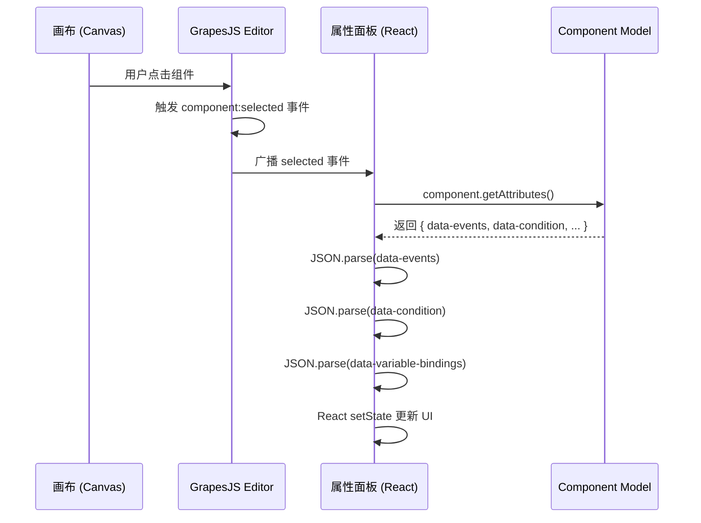
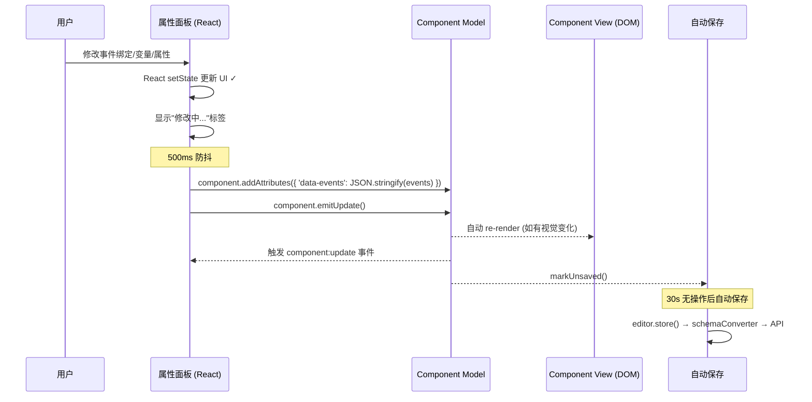

# 低代码编辑器：属性面板与画布实时通信机制

> 本文档解析 GrapesJS Studio SDK 编辑器中，右侧属性面板修改属性/样式/事件/变量后，中间编辑区域（画布）如何实时更新。

---

## 1. 架构总览

### 1.1 核心设计理念

编辑器采用 **GrapesJS Component Model 作为唯一可信数据源（Single Source of Truth）**。所有组件树的状态增删改查都发生在 GrapesJS 内部的 Component 模型层，而非 React 状态或 Redux。

```
┌────────────────────────────────────────────────────────────────────┐
│                         GrapesJS Editor                            │
│                                                                    │
│   ┌──────────────────────┐    ┌────────────────────┐              │
│   │   Component Model    │◄──►│   Component View   │              │
│   │   (数据模型层)        │    │   (画布 DOM 渲染)    │              │
│   │                      │    │                    │              │
│   │   - getAttributes()  │    │   自动 re-render    │              │
│   │   - addAttributes()  │    │                   │              │
│   │   - setStyle()       │    │                   │              │
│   │   - emitUpdate()     │    │                   │              │
│   └──────────┬───────────┘    └────────────────────┘              │
│              │                                                     │
│   ┌──────────▼───────────┐    ┌────────────────────┐              │
│   │   Event System       │    │   Undo Stack       │              │
│   │   (发布订阅事件总线)   │    │   (撤销/重做)       │              │
│   └──────────────────────┘    └────────────────────┘              │
└────────────────────────────────────────────────────────────────────┘
         ▲                                      ▲
         │         ┌──────────────────┐          │
         │         │   schemaConverter │          │
         │         │   (序列化桥接)     │          │
         │         └──────────────────┘          │
         │                                      │
┌────────┴────────────────┐   ┌─────────────────┴───────────────┐
│    属性面板 (右侧)        │   │       画布 (中间编辑区域)         │
│                          │   │                                 │
│  ┌────────────────────┐  │   │   Iframe 内独立渲染              │
│  │ panelStyles (样式)  │──┼──►│   GrapesJS 自动 DOM diff       │
│  │ panelProperties    │  │   │                                 │
│  │ (属性)              │  │   │   用户拖拽/编辑交互              │
│  │                    │  │   │                                 │
│  │ EventBindingTab    │──┼──►│   component:selected 事件       │
│  │ (事件绑定)          │  │   │   反向通知面板读取数据            │
│  │                    │  │   │                                 │
│  │ VariableBindingTab │──┼──►│   data-condition 条件显隐        │
│  │ (变量绑定)          │  │   │   data-events 事件绑定           │
│  └────────────────────┘  │   │   data-variable-bindings 变量   │
└──────────────────────────┘   └─────────────────────────────────┘
```

### 1.2 关键原则

| 原则 | 说明 |
|------|------|
| **Model 驱动 View** | Component Model 是唯一来源，View 根据 Model 自动渲染 |
| **属性即数据** | 自定义数据全部存储在组件 `data-*` 属性上，JSON 序列化 |
| **事件驱动** | 属性面板与画布通过 GrapesJS 内置事件总线通信，无自定义 EventBus |
| **防抖写入** | 属性面板写入模型有 500ms 防抖，避免频繁触发重渲染 |

---

## 2. 数据存储模型

### 2.1 Redux 的职责边界

**Redux 不存储任何画布内容**，只管理应用级状态：

```typescript
// store/index.ts — Redux Store
{
  auth: { user, token, ... },   // 用户认证
  theme: { mode: 'light' },     // 主题
  locale: { lang: 'zh-CN' },    // 国际化
}
// 画布组件树 → 不存在这里，全部在 GrapesJS 内部
```

### 2.2 Component Model 数据存储

GrapesJS 的每个 Component 有两大存储区域：

#### 标准属性（GrapesJS 原生管理）

| API | 用途 | 示例 |
|-----|------|------|
| `component.setStyle()` | CSS 样式 | `{ color: 'red', fontSize: '16px' }` |
| `component.setTraits()` | 组件属性 | `{ placeholder: '请输入...' }` |
| `component.setContent()` | HTML 内容 | `'<p>Hello</p>'` |
| `component.setAttributes()` | HTML 属性 | `{ class: 'my-btn', id: 'btn-1' }` |

#### 自定义属性（应用层数据，存储在 `data-*` 属性上）

| 属性键 | 存储内容 | 用途 | 所属面板 |
|--------|----------|------|----------|
| `data-events` | `EventBinding[]` JSON | 事件绑定配置 | 事件 Tab |
| `data-condition` | `ConditionConfig` JSON | 条件显隐规则 | 变量 Tab |
| `data-conditional-hidden` | `'true'` | 强制隐藏 | 变量 Tab |
| `data-variable-bindings` | `VariableBinding[]` JSON | 模板变量映射 | 变量 Tab |
| `data-schema-type` | `string` | 组件类型标识 | schemaConverter |

#### Component Model 内部结构示意

```
Component Model
├── type: "text"              // GrapesJS 组件类型
├── name: "标题文本"
├── classes: ["heading"]      // CSS 类名
├── style: {                  // CSS 样式
│   color: "#333",
│   fontSize: "24px"
│ }
├── traits: [                 // 组件属性（可编辑）
│   { name: "placeholder", value: "请输入..." }
│ ]
├── attributes: {             // HTML 属性 + 自定义数据
│   class: "heading",
│   id: "title-1",
│   "data-events": '[{"event":"click","actions":[...]}]',
│   "data-condition": '{"field":"role","operator":"eq","value":"admin"}',
│   "data-variable-bindings": '[{"prop":"content","variable":"username"}]',
│   "data-schema-type": "heading"
│ }
└── components: [...]         // 子组件
```

---

## 3. 通信流程详解

### 3.1 读取路径：画布选中 → 面板显示

当用户在画布点击一个组件时：



关键代码（`EventBindingTabContent.tsx`）：

```typescript
// 订阅组件选中事件
useEffect(() => {
  if (!editor) return;
  
  const onSelect = (component: Component) => {
    setSelectedComponent(component);
    const events = readEventsFromComponent(component);
    setEvents(events);
  };

  editor.on('component:selected', onSelect);
  return () => editor.off('component:selected', onSelect);
}, [editor]);

// 从 Component Model 读取事件数据
function readEventsFromComponent(component: Component | null): EventBinding[] {
  if (!component) return [];
  
  // 1. 优先从 model 读取（可持久化，主力路径）
  const attrs = component.getAttributes();
  const modelData = attrs['data-events'] as string;
  if (modelData) {
    try { return JSON.parse(modelData); } catch { /* fallback */ }
  }
  
  // 2. 降级：从 DOM 读取（兼容旧数据）
  const el = component.getEl();
  if (!el) return [];
  const domData = el.getAttribute('data-events');
  if (domData) {
    try { return JSON.parse(domData); } catch { /* fallback */ }
  }
  
  return [];
}
```

### 3.2 写入路径：面板修改 → 画布更新（完整链路）



#### 第 1 步：用户修改 → React 状态更新

用户操作触发 React 的 `setState`，面板 UI 即时反馈（添加/删除绑定项、显示"修改中..."标签）。此时**尚未影响画布**。

```typescript
// 添加新的事件绑定
const handleAddEvent = () => {
  setEvents(prev => [
    ...prev,
    { event: 'click', actions: [createDefaultAction('toast')] }
  ]);
  setModified(true);  // 显示"修改中..."
};
```

#### 第 2 步：500ms 防抖

使用 `useRef` 保存定时器，每次修改时重置倒计时。防止高频拖拽或快速输入时频繁触发模型写入。

```typescript
const saveTimerRef = useRef<ReturnType<typeof setTimeout>>();

const scheduleSave = useCallback((cmp: Component, evts: EventBinding[]) => {
  if (saveTimerRef.current) clearTimeout(saveTimerRef.current);
  saveTimerRef.current = setTimeout(() => {
    writeEventsToComponent(cmp, evts);   // 真正写入模型
    setSaveHint('');                       // 清除"修改中..."
  }, 500);
}, []);
```

#### 第 3 步：写入 Component Model

防抖结束后，调用 GrapesJS 的 Component API 写入模型：

```typescript
function writeEventsToComponent(
  component: Component | null,
  events: EventBinding[],
): void {
  if (!component) return;
  
  if (events.length === 0) {
    // 清空时从 model 移除属性
    const current = component.getAttributes();
    const { 'data-events': _unused, ...rest } = current;
    component.setAttributes(rest);
  } else {
    component.addAttributes({ 'data-events': JSON.stringify(events) });
  }
  
  component.emitUpdate();  // ← 关键！触发更新
}
```

`emitUpdate()` 是 GrapesJS 内部的核心 API，调用后会：

1. 标记组件为"脏"状态
2. 触发 `component:update` 事件
3. 如果模型变化影响到 DOM（如样式、属性），自动触发布局重算和 DOM 更新
4. 记录操作到 Undo Stack

#### 第 4 步：自动保存（旁路链路）

```typescript
// index.tsx onReady 中注册
const markUnsaved = () => {
  if (saveStatusRef.current === "saving") return;
  saveStatusRef.current = "unsaved";
  setSaveStatus("unsaved");
  
  // 30 秒无操作后自动保存
  if (autoSaveTimerRef.current) clearTimeout(autoSaveTimerRef.current);
  autoSaveTimerRef.current = setTimeout(async () => {
    // 差异检测：比对上一步保存的数据
    const currentData = editor.getProjectData();
    const currentStr = JSON.stringify(currentData);
    if (currentStr === lastSavedComponentsRef.current) {
      return; // 无变更，跳过
    }
    
    saveStatusRef.current = "auto-saving";
    setSaveStatus("auto-saving");
    await editor.store();  // 触发 storage.onSave 回调
    saveStatusRef.current = "saved";
    setSaveStatus("saved");
  }, 30000);
};

// 订阅所有组件变更事件
editor.on("component:update", markUnsaved);
editor.on("component:add", markUnsaved);
editor.on("component:remove", markUnsaved);
editor.on("style:update", markUnsaved);
editor.on("block:drag:stop", markUnsaved);
```

### 3.3 内置面板的通信路径（Styles / Props）

GrapesJS Studio SDK 内建的 `panelStyles`（样式面板）和 `panelProperties`（属性面板）不走 `data-*` 属性，而是直接操作 GrapesJS 的 Style Model 和 Trait Model：

| 面板 | 读取 API | 写入 API | 更新触发 |
|------|----------|----------|----------|
| 样式 `panelStyles` | `component.getStyle()` | `component.setStyle()` | 自动触发 `component:update` |
| 属性 `panelProperties` | `component.getTraits()` | `component.setTraits()` | 自动触发 `component:update` |

这些操作**完全在 GrapesJS 内核内完成**，不需要额外的序列化/反序列化步骤。

---

## 4. 序列化桥接：schemaConverter

### 4.1 职责边界

`schemaConverter.ts` **不参与实时通信**，只在以下三个时机起作用：

1. **保存到服务器** — `editor.store()` → `storage.onSave` → `buildPageSchemaJson()`
2. **发布/预览** — `buildPageSchemaJson()` → 传递给 `@abner-blog/page-schema` 渲染引擎
3. **SchemaPreview 面板** — 显示当前组件树的 JSON 结构（可选编辑并回写）

### 4.2 转换流程

```
GrapesJS Component Tree
        │
        ▼
buildPageSchema(editor)
        │
        ├── 遍历 wrapper 的子组件
        ├── detectSchemaType() 确定组件类型
        ├── extractComponentProps() 提取 props
        ├── extractEvents() 提取 data-events → node.events
        ├── extractCondition() 提取 data-condition → node.props.condition
        ├── extractVariableBindings() 提取 data-variable-bindings → 注入 props
        └── 递归处理子组件 children
        │
        ▼
SchemaNode[]  (JSON 可序列化)
        │
        ├──→ 存储到数据库 Page.schema
        └──→ 传给 PageRenderer 在 C 端渲染
```

### 4.3 与渲染引擎的对应关系

| 编辑器存储属性 | Schema 字段 | 渲染引擎中间件 |
|---------------|-------------|---------------|
| `data-events` | `node.events` | `event-handler.ts` 中间件 |
| `data-condition` | `node.condition` | `condition.ts` 中间件 |
| `data-variable-bindings` | node props 中的 `{{key}}` | `variable-parser.ts` 中间件 |

---

## 5. 关键代码索引

| 文件 | 职责 | 关键函数/方法 |
|------|------|---------------|
| `src/pages/PageEditor/index.tsx` | 主编辑器布局 & 自动保存 | `markUnsaved()`, `buildDualRegion()` |
| `src/pages/PageEditor/EventBindingTabContent.tsx` | 事件绑定面板 | `readEventsFromComponent()`, `writeEventsToComponent()`, `scheduleSave()` |
| `src/pages/PageEditor/VariableBindingTabContent.tsx` | 变量绑定面板 | `readConfigFromComponent()`, `writeConfigToComponent()`, `syncAutoEventBindings()` |
| `src/utils/schemaConverter.ts` | 组件树 ↔ Schema JSON | `buildPageSchema()`, `convertComponent()`, `extractComponentProps()` |
| `packages/page-schema/src/middleware/event-handler.ts` | 渲染引擎事件执行 | `EventHandlerWrapper`, `createBindingHandler()` |
| `packages/page-schema/src/middleware/condition.ts` | 渲染引擎条件显隐 | `evaluateCondition()` |
| `packages/page-schema/src/middleware/variable-parser.ts` | 渲染引擎变量解析 | `resolveTemplate()` |

---

## 6. 面试回答话术

### 一句话概括

> **低代码编辑器中属性面板与画布的实时通信，本质上是「共享数据源 + 发布订阅」模式。GrapesJS 的 Component Model 是唯一可信数据源，属性面板通过 `component.addAttributes()` + `emitUpdate()` 将修改写入模型，GrapesJS 依赖其内置的 Model-View 绑定自动重渲染画布。自定义数据（事件、变量、条件）以 JSON 字符串存储在 `data-*` 属性上，无需独立的 EventBus 或状态管理库。**

### 追问 1：为什么不用 Redux？

> GrapesJS 自身拥有完整的 Model-View 绑定、Undo/Redo 栈、脏检测和事件系统。如果用 Redux 存储画布内容，需要手动同步 GrapesJS ↔ Redux，还要自己实现撤销回退功能，相当于在 GrapesJS 之上再盖一层状态管理，增加复杂度且没有收益。

### 追问 2：怎么保证性能不卡顿？

> 三个方面：一是**500ms 防抖**，高频操作（如拖拽滑块、快速输入）不会每次触发模型写入；二是 GrapesJS 内部的**增量 DOM diff**，只有变化的组件会重渲染；三是 schemaConverter 只在保存/预览时执行，不阻塞编辑操作。

### 追问 3：如果用户在 SchemaPreview 直接编辑 JSON，如何回流到画布？

> 使用 `editor.loadProjectData(projectData)` 批量注入整个项目数据，触发全量重绘。这是一种**低成本、全量替换**的方式，与属性面板的增量写入是两条不同的路径。
