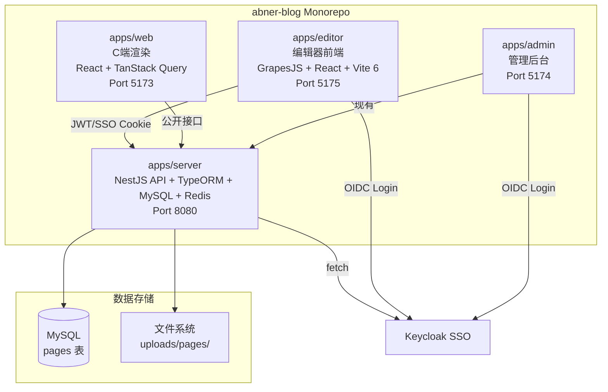
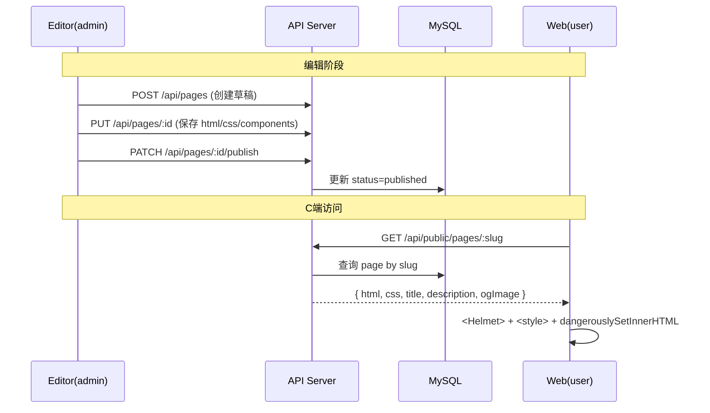

# 低代码页面平台 - 产品规格文档 (SPEC)

> **版本**: v1.0  
> **日期**: 2026-06-21  
> **状态**: 草案  

---

## 1. 概述

### 1.1 项目目标

在现有博客系统基础上，新增**低代码页面搭建平台**，允许内部运营/内容编辑人员通过拖拽式编辑器快速搭建营销页、活动页、博客落地页。

### 1.2 目标用户

内部运营 / 内容编辑人员，无技术背景。

### 1.3 核心原则

- **复用优先**：后端复用现有 NestJS 项目（apps/server），C 端渲染复用现有博客前端项目（apps/web）
- **渐进增强**：MVP 聚焦核心拖拽编辑能力，后续迭代添加高级功能
- **数据安全**：已发布的页面数据采用软删除，防止误删

### 1.4 名词定义

| 术语 | 说明 |
|------|------|
| **Page** | 低代码编辑器生成的页面，包含 html、css、组件结构三份数据 |
| **Editor** | 编辑器前端项目 (apps/editor)，GrapesJS + React |
| **Renderer** | C 端渲染，web 端通过 `/page/:slug` 路由渲染已发布的页面 |
| **Block** | GrapesJS 中的可拖拽组件（如文本、图片、按钮等） |

---

## 2. 系统架构

### 2.1 整体架构图



### 2.2 项目结构变更

```
apps/
├── editor/                    ← NEW：编辑器项目
│   ├── src/
│   │   ├── pages/             # 页面组件
│   │   │   ├── PageList/      # 页面列表
│   │   │   ├── PageEditor/    # GrapesJS 编辑器
│   │   │   └── Login/         # SSO 登录页
│   │   ├── components/        # 共享组件
│   │   ├── services/          # API 层
│   │   ├── store/             # Auth slice
│   │   ├── App.tsx
│   │   └── main.tsx
│   ├── index.html
│   ├── vite.config.ts
│   └── package.json
├── server/                    ← 新增 pages 模块
│   └── src/
│       └── modules/
│           └── pages/         ← NEW：pages 模块
│               ├── controllers/
│               ├── services/
│               ├── dto/
│               └── entities/
├── web/                       ← 新增 /page/:slug 路由
│   └── src/
│       ├── pages/
│       │   └── PageDetail/    ← NEW：C 端渲染
│       └── routes/
```

### 2.3 数据流



---

## 3. 后端设计 (apps/server)

### 3.1 数据模型

```typescript
// src/modules/pages/entities/page.entity.ts

@Entity('pages')
export class Page {
  @PrimaryGeneratedColumn()
  id: number;

  @Column({ length: 200 })
  title: string;                              // 页面标题

  @Column({ length: 200, unique: true })
  slug: string;                               // URL 标识，唯一

  @Column({ type: 'text', nullable: true })
  description?: string;                       // SEO 描述

  @Column({ type: 'simple-array', nullable: true })
  keywords?: string[];                        // SEO 关键词

  @Column({ nullable: true })
  ogImage?: string;                           // Open Graph 图片

  @Column({ type: 'longtext' })
  html: string;                               // GrapesJS 生成的 HTML

  @Column({ type: 'longtext' })
  css: string;                                // GrapesJS 生成的 CSS

  @Column({ type: 'longtext' })
  components: string;                         // GrapesJS 组件 JSON（用于继续编辑）

  @Column({ type: 'varchar', length: 20, default: 'draft' })
  status: 'draft' | 'published' | 'archived';

  @Column({ nullable: true })
  publishedAt?: Date;

  @CreateDateColumn()
  createdAt: Date;

  @UpdateDateColumn()
  updatedAt: Date;

  // 软删除（项目新引入的模式）
  @DeleteDateColumn()
  deletedAt?: Date;
}
```

**表名**: `pages`  
**核心索引**:
- `slug` — 唯一索引（公开接口查询）
- `status` — 索引（管理端列表筛选）
- `deletedAt` — 软删除查询

### 3.2 API 设计

#### 3.2.1 页面管理接口（需认证：JWT 或 SSO Session）

| 方法 | 路径 | 说明 | 请求体 | 返回 |
|------|------|------|--------|------|
| `POST` | `/api/pages` | 创建页面草稿 | `{ title, slug, description?, keywords?, ogImage? }` | `Page` |
| `GET` | `/api/pages` | 分页列表（含状态筛选） | Query: `page, pageSize, status?, keyword?` | 分页响应 |
| `GET` | `/api/pages/:id` | 获取页面详情（含 html/css/components） | — | `Page` |
| `PUT` | `/api/pages/:id` | 更新页面全部内容 | `{ title?, slug?, description?, html?, css?, components?, ogImage? }` | `Page` |
| `DELETE` | `/api/pages/:id` | 软删除页面 | — | 204 |
| `PATCH` | `/api/pages/:id/publish` | 发布 (draft → published) | — | `Page` |
| `PATCH` | `/api/pages/:id/archive` | 归档 (published → archived) | — | `Page` |

#### 3.2.2 文件上传

| 方法 | 路径 | 说明 |
|------|------|------|
| `POST` | `/api/pages/upload` | 上传页面图片，存至 `uploads/pages/`，返回 URL |

- 复用现有 multer 配置，仅目录改为 `uploads/pages/`
- 支持图片类型：jpg, png, gif, webp, svg

#### 3.2.3 公开接口（无需认证）

| 方法 | 路径 | 说明 |
|------|------|------|
| `GET` | `/api/public/pages/:slug` | 根据 slug 获取已发布的页面，返回 `{ title, description, keywords, ogImage, html, css }` |

### 3.3 认证方案

复用现有的 **双认证模式**：

```typescript
// 页面管理控制器
@UseGuards(AuthGuard(['editor-jwt', 'sso-session']), AdminGuard)
```

- `editor-jwt`：编辑器的 JWT 策略（可选的，若 editor 不想支持 JWT 登录，可只保留 `sso-session`）
- `sso-session`：Keycloak SSO Cookie 策略（直接复用现有 SSOModule）
- `AdminGuard`：验证用户角色为 admin

**编辑器 SSO 流程**（与 admin 一致）：

```
1. 用户访问 editor 页面列表，未登录
2. 前端调 GET /api/sso/status → 返回未认证
3. 展示登录页（"使用 SSO 登录"按钮）
4. 用户点击 → 跳转 /api/sso/authorize
5. Keycloak 认证 → 回调到 /api/sso/callback → 设 sso_session cookie
6. 重定向回 editor
7. 前端调 GET /api/sso/status → 已认证 → 进入页面列表
```

**需要调整**：SSO 回调后重定向的目标 URL 需改为 editor 地址（目前硬编码为 admin），在 state 参数中使用 `redirectTo` 字段动态处理。

### 3.4 后端模块结构

```
src/modules/pages/
├── pages.module.ts
├── controllers/
│   ├── pages.controller.ts        # 管理端 CRUD
│   └── public-pages.controller.ts # 公开接口
├── services/
│   ├── pages.service.ts           # 业务逻辑
│   └── pages-assets.service.ts    # 文件上传
├── dto/
│   ├── create-page.dto.ts
│   ├── update-page.dto.ts
│   ├── page-query.dto.ts
│   └── publish-page.dto.ts
├── entities/
│   └── page.entity.ts
└── guards/
    └── page-owner.guard.ts        # 可选：资源归属验证
```

---

## 4. 编辑器 (apps/editor)

### 4.1 技术栈

| 类别 | 选择 |
|------|------|
| 框架 | React 18 + TypeScript |
| 构建工具 | Vite 6 |
| 组件库 | Ant Design 6 |
| 低代码引擎 | GrapesJS + react-grapesjs |
| 路由 | React Router 6 |
| 状态管理 | 仅 auth slice（参考 admin 的 Redux Toolkit），编辑器状态由 GrapesJS 自管 |
| HTTP | axios，封装 API 层 |
| 样式 | LESS + CSS Modules（编辑器内部组件隔离） |
| 认证 | Keycloak SSO（复用现有 SSO 流程） |

### 4.2 端口

- **开发端口**: 5175
- **monorepo 包名**: `@abner-blog/editor`

### 4.3 路由设计

| 路径 | 组件 | 说明 | 需登录 |
|------|------|------|--------|
| `/login` | LoginPage | SSO 登录页 | 否 |
| `/` | PageList | 页面列表（首页） | 是 |
| `/editor/:id` | PageEditor | GrapesJS 编辑器 | 是 |
| `/preview/:id` | PagePreview | 预览页面（GrapesJS 内置预览） | 是 |

### 4.4 页面列表 (PageList)

复用 Ant Design Table，展示：

| 列 | 说明 |
|----|------|
| 标题 | 页面标题，带文字截断 |
| Slug | URL 路径标识 |
| 状态 | Tag：草稿(blue) / 已发布(green) / 已归档(gray) |
| 更新时间 | relative time |
| 操作 | 编辑 / 预览 / 发布(草稿时) / 归档(已发布时) / 删除 |

- 支持分页、按标题搜索、按状态筛选
- 删除使用 Popconfirm 二次确认

### 4.5 编辑器布局 (PageEditor)

采用 **GrapesJS 默认布局 + 自定义 React 顶部工具栏**：

```
┌──────────────────────────────────────────────────────────┐
│  ← 返回列表  │  页面标题  │  [💾 保存]  [🚀 发布]       │
├──────────┬───────────────────────────────┬───────────────┤
│  左侧     │         画布                  │   右侧        │
│  Blocks   │    (Canvas)                   │  Style Manager │
│  Layers   │                               │   Traits       │
│           │                               │               │
└──────────┴───────────────────────────────┴───────────────┘
```

**顶部工具栏（React 自定义）**：
- 返回按钮：回到页面列表
- 页面标题：显示当前编辑的页面标题
- 保存按钮：保存草稿（仅调 API 保存，不改变状态）
- 发布按钮：保存 + 发布（状态改为 published）
- 设备切换：GrapesJS 设备模式（Desktop/Tablet/Mobile）

### 4.6 GrapesJS Blocks（MVP 组件集）

**布局组件**：
- Container — 容器块，内部可拖入其他组件
- Row / Column — 行列布局，响应式网格
- Section — 区块分区，支持背景色/背景图设置

**内容组件**：
- Heading — 标题 (H1~H6)
- Text — 富文本段落
- Image — 图片（支持上传和外链）
- Button — 按钮，可配置文字、链接、样式
- Divider — 分割线
- Spacer — 空白间距
- Video — 视频嵌入（URL 嵌入，支持 YouTube/Bilibili 等）

**高级**：
- HTML Embed — 自定义 HTML 代码块，给高级用户使用

### 4.7 图片上传流程

```
用户点击 Image 组件 → 打开图片选择弹窗
  ├─ 从 URL 输入（外链）
  └─ 上传新图片 → POST /api/pages/upload → 返回 URL → 填入图片组件
```

### 4.8 保存逻辑

- **手动保存**：用户点击"保存"或"发布"按钮时触发
- 保存时发送 `PUT /api/pages/:id`，携带 `html`、`css`、`components` 三个字段
- 发布时额外发送 `PATCH /api/pages/:id/publish`

### 4.9 认证实现（前端）

参考 admin 的 auth 实现，精简版：

1. `store/authSlice.ts` — 管理 SSO 认证状态
2. `services/sso.ts` — `getSSOStatus()`、`logout()` 接口
3. `App.tsx` — 启动时调 `/api/sso/status` 检查会话
4. `LoginPage` — SSO 按钮，跳转 `/api/sso/authorize`
5. `http.ts` — 请求拦截器（SSO 模式下 cookie 自动携带，无需额外处理）

### 4.10 配置

**apps/editor/.env**:
```env
VITE_API_BASE_URL=http://localhost:8080/api
VITE_SSO_AUTHORIZE_URL=http://localhost:8080/api/sso/authorize
```

---

## 5. C 端渲染 (apps/web)

### 5.1 路由

新增路由 `/page/:slug`，配置在 `routes/index.tsx`：

```tsx
{
  path: '/page/:slug',
  element: <PageDetail />,
  requireAuth: false,
}
```

### 5.2 渲染组件

```tsx
// apps/web/src/pages/PageDetail/index.tsx
function PageDetail() {
  const { slug } = useParams();
  const { data, isLoading, error } = useQuery({
    queryKey: ['page', slug],
    queryFn: () => api.get(`/api/public/pages/${slug}`),
  });

  if (isLoading) return <Spin fullscreen />;
  if (error || !data) return <Result status="404" title="页面不存在" />;

  return (
    <>
      <Helmet>
        <title>{data.title}</title>
        <meta name="description" content={data.description} />
        <meta property="og:image" content={data.ogImage} />
        <meta name="keywords" content={data.keywords?.join(', ')} />
      </Helmet>
      <style>{data.css}</style>
      <div dangerouslySetInnerHTML={{ __html: data.html }} />
    </>
  );
}
```

### 5.3 全屏渲染

将 `'/page'` 加入 `AppShell` 的 `STANDALONE_PATHS` 数组：

```tsx
const STANDALONE_PATHS = ['/chat', '/chat/share', '/page'] as const;
```

这样 `'/page/:slug'` 路由会自动：
- 不渲染 Navbar / MobilePageHeader
- 不渲染 SiteFooter
- 不在 width-constrained 容器内渲染
- 页面标题和 SEO meta 通过 `react-helmet-async` 设置

### 5.4 SEO 支持

需要在 web 端新增 `react-helmet-async` 依赖：

```bash
pnpm add react-helmet-async
```

并在 `App.tsx` 中添加 `<HelmetProvider>` 包裹。

（注意：若 web 端选择 SSR，`react-helmet-async` 也支持 SSR，后续可扩展。）

---

## 6. 分阶段实施计划

### 第一阶段：MVP（目标周期：~2周）

#### 第1步：后端基础 (2天)

| 任务 | 涉及文件 |
|------|---------|
| 新建 `pages` 模块：Entity + Module | `apps/server/src/modules/pages/` |
| 实现 Page CRUD Service | `pages.service.ts` |
| 实现管理端 Controller（含认证 Guard） | `pages.controller.ts` |
| 实现公开接口 Controller | `public-pages.controller.ts` |
| 实现图片上传（`uploads/pages/`） | `pages-assets.service.ts` |
| 创建 `pages` 数据库迁移 | TypeORM migration |
| 调整 SSO callback redirect 支持 editor | `sso-auth.controller.ts` |

#### 第2步：editor 项目初始化 (1天)

| 任务 | 涉及文件 |
|------|---------|
| 创建 `apps/editor` 项目（Vite + React） | 脚手架初始化 |
| 配置 TypeScript、LESS、路径别名 | `vite.config.ts`, `tsconfig.json` |
| 配置 Ant Design 6 | 按需加载 |
| 配置路由（Login / PageList / PageEditor） | `App.tsx` |
| 配置 http 层 + auth store | `services/`, `store/` |
| 实现 SSO 登录页 + 认证流程 | `Login/`, `App.tsx` |

#### 第3步：编辑器核心 (3天)

| 任务 | 涉及文件 |
|------|---------|
| 集成 GrapesJS + react-grapesjs | `PageEditor/index.tsx` |
| 自定义顶部工具栏（保存/发布/返回） | `PageEditor/Toolbar.tsx` |
| 配置 Blocks（布局/内容/高级组件） | `PageEditor/blocks.ts` |
| 配置 Style Manager（样式面板） | `PageEditor/styles.ts` |
| 配置 Image 组件上传 | `PageEditor/ImageUpload.tsx` |
| 实现保存/发布逻辑 | `PageEditor/hooks/useSave.ts` |

#### 第4步：页面列表 (1天)

| 任务 | 涉及文件 |
|------|---------|
| 页面列表页（Ant Design Table） | `PageList/index.tsx` |
| 创建页面弹窗 | `PageList/CreateDialog.tsx` |
| 删除确认弹窗 | `PageList/DeleteAction.tsx` |
| 状态切换操作 | `PageList/StatusActions.tsx` |

#### 第5步：C 端渲染 (1天)

| 任务 | 涉及文件 |
|------|---------|
| 新增 `/page/:slug` 路由 | `routes/index.tsx` |
| 实现 PageDetail 组件 | `pages/PageDetail/index.tsx` |
| 添加 STANDALONE_PATHS | `AppShell/index.tsx` |
| 添加 react-helmet-async | `App.tsx`, `package.json` |

### 第二阶段：增强功能（MVP 后，~1周）

| 优先级 | 功能 | 说明 |
|--------|------|------|
| P1 | 表单组件 | 收集用户信息（留言/咨询），数据存数据库 |
| P1 | 导航菜单组件 | 页面内锚点导航 |
| P2 | 区块模板 | 保存常用布局为模板，新建页面时可选择模板 |
| P2 | 自动保存草稿 | 编辑时每隔 30s 自动保存（防丢失） |

### 第三阶段：高级功能（远期）

| 功能 | 说明 |
|------|------|
| 自定义组件/组件市场 | 可注册自定义 React 组件到 GrapesJS |
| 页面访问统计 | PV/UV 统计 |
| A/B 测试 | 同一页面多版本对比 |
| 多语言支持 | 页面内容国际化 |
| 发布审批流程 | 编辑 → 审核 → 发布 |

---

## 7. 附录

### 7.1 关键依赖

**apps/editor/package.json** (核心依赖)：
```json
{
  "dependencies": {
    "grapesjs": "^0.21.x",
    "react-grapesjs": "^x.x.x"
  }
}
```

**具体的 GrapesJS 版本和 react-grapesjs 版本**需在实施时确认最新稳定版。

### 7.2 参考资源

- [GrapesJS 官方文档](https://grapesjs.com/docs/)
- [react-grapesjs](https://github.com/Ju99ernaut/react-grapesjs)
- [GrapesJS 内置组件文档](https://grapesjs.com/docs/modules/Blocks.html)

### 7.3 风险与注意事项

| 风险 | 影响 | 缓解措施 |
|------|------|----------|
| GrapesJS 与 React 集成深度不足 | 编辑器功能受限 | 通过 editor ref 直接访问原生实例，不受 wrapper 限制 |
| 生成的 HTML/CSS 污染博客样式 | 页面样式异常 | GrapesJS CSS 默认使用唯一类名前缀；必要时加 Shadow DOM |
| Keycloak callback 地址硬编码 | 多项目共享 SSO 冲突 | 使用 state.redirectTo 参数动态决定回调地址 |
| 图片存储在服务器本地 | 存储空间有限，无法水平扩展 | MVP 先用本地存储，后续可迁移至 OSS |
